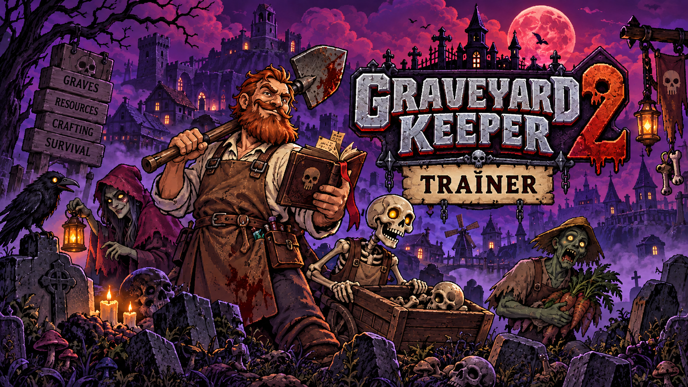

# Graveyard Keeper 2 — Trainer

**Infinite energy and resources, instant crafting, perfect corpse quality, unlimited tech points, tireless zombie workers, invincible undead army.**
Free, open source, no installer. Opens with `Insert`.

**[⬇ Download the latest release](https://github.com/Beigewithinpack/Graveyard-Keeper-2-Trainer/releases/latest)** · [Hotkeys](#hotkeys) · [FAQ](#faq)

> **[⬇️ Download the latest Graveyard Keeper 2 trainer](https://github.com/Beigewithinpack/Graveyard-Keeper-2-Trainer/releases/latest)**

    

---

> [!NOTE]
> Single-player only. No multiplayer, no anti-cheat, nothing here reaches anyone else.

## What it does

Lazy Bear cut a lot of the original's grind for the sequel — automation, zombie workers, conveyor factories, Milestones instead of the old Teleportstone. What survived is the shape of a Graveyard Keeper game: an energy bar that ends your day before your to-do list does, three colours of technology points that never quite cover the next unlock, and a corpse quality system that rewards patience you may not have at 1 AM.

The two options worth installing this for are **infinite energy** and **infinite tech points**. Everything else is optional. **Perfect corpse quality** is the one to think about before switching on — the autopsy loop is the series' signature and the reason the graveyard half has any texture at all.

## Features

<strong>Keeper</strong> — you, and the energy bar

| Option | Hotkey | What it does |
|---|---|---|
| Infinite energy | `F1` | The bar stops ending your day |
| Infinite health | `F2` | — |
| Damage taken | slider | `0%`–`100%` |
| No hunger or sleep need | — | — |
| Infinite carry weight | — | Haul the whole quarry in one trip |
| Movement speed | slider | `1x`–`10x` |
| Tool durability never drops | — | — |
| Infinite stamina for gathering | — | Chopping, mining, digging |

<strong>Graveyard</strong> — bodies, burials and the church

| Option | Hotkey | What it does |
|---|---|---|
| Perfect corpse quality | `F5` | Every body arrives pristine — see the warning below |
| No corpse decay | — | Bodies keep indefinitely |
| Instant burial and embalming | — | No animation, no wait |
| Free body parts | — | Skulls, flesh, bones, blood |
| Grave value multiplier | slider | `1x`–`50x` |
| Church income multiplier | slider | `1x`–`50x` |
| Sermon quality always maximum | — | — |
| Unlock all graveyard decorations | — | `save` |

<strong>Crafting</strong> — resources, workshops and building

| Option | Hotkey | What it does |
|---|---|---|
| Infinite resources | `F3` | Wood, stone, iron, herbs, everything |
| Resource multiplier | slider | `1x`–`50x` |
| Instant crafting | `F4` | No timers on any bench |
| Free building | — | Structures cost nothing |
| Instant construction | — | Buildings finish when placed |
| Unlimited storage | — | Chests never fill |
| No quality loss | — | Every craft at top tier |
| Unlock all recipes and blueprints | — | `save` |

<strong>Automation</strong> — zombie labour and conveyors

| Option | Hotkey | What it does |
|---|---|---|
| Zombies never tire | `F6` | No refreshing, no decay |
| Zombie work speed | slider | `1x`–`20x` |
| Unlimited zombie workers | — | Past the game's cap |
| Free zombie creation | — | No flasks, no cost |
| Conveyor speed | slider | `1x`–`20x` |
| No power or fuel drain | — | — |
| Machines never break | — | — |
| Unlock all automation tech | — | `save` |

<strong>Army</strong> — the four thousand that need a permanent solution

| Option | Hotkey | What it does |
|---|---|---|
| Undead army invulnerable | `F7` | Your zombies stop dying |
| Army damage multiplier | slider | `1x`–`50x` |
| Army size | slider | `1`–`200` |
| Instant army revival | — | Fallen units return between waves |
| Enemy wave size | slider | `10%`–`300%` — works both ways |
| Freeze enemy AI | — | They spawn, they never advance |
| Unlock all unit types and upgrades | — | `save` |
| Tower and trap damage | slider | `1x`–`50x` |

<strong>Progress</strong> — points, talents and the Town

| Option | Hotkey | What it does |
|---|---|---|
| Infinite technology points | `F8` | All three colours |
| Infinite money | `F9` | — |
| Infinite talent points | — | The sequel's new system |
| Unlock the full tech tree | — | `save` |
| Unlock all talents and skills | — | `save` |
| Instant town restoration | — | Buildings rebuild on placement |
| Town reputation always maximum | — | — |
| Instant quest completion | — | `spoiler`, off by default |
| Villagers always friendly | — | No gift or favour requirements |

<strong>World</strong> — time, travel and the map

| Option | Hotkey | What it does |
|---|---|---|
| Freeze the day | `F10` | Hold the clock where it stands |
| Time of day | slider | Any hour |
| Set the weekday | dropdown | For NPCs who only appear on certain days |
| Game speed | slider | `0.1x`–`5.0x` |
| Unlock all Milestones | — | `save` — fast travel everywhere |
| Reveal the map | — | — |
| Unlock all zones | — | `save` |
| Highlight resources and NPCs | slider | Radius `10`–`200 m` |

<strong>System</strong> — display and menu settings

Camera zoom `0.5x`–`4x` past the game's limit, free camera `F11`, hide interface `F12`, **force borderless window** (the game shipped without the option), disable screen shake, extended photo mode. Plus rolling save backup with interval, read-only mode, achievement block, rebindable menu key and overlay opacity.

## Hotkeys

`Insert` opens the menu · `End` resets everything · `F1`–`F12` as above, all rebindable · arrow keys and `Enter` navigate without a mouse

> [!TIP]
> **The setup that cuts the grind without cutting the game:** infinite energy, infinite technology points, conveyor speed at 5x, zombie work speed at 5x. You still gather every resource, run every autopsy and design every production line — you just stop being told the day is over.
>
> **Force borderless window** is not a cheat. The game shipped without a borderless mode and people are reporting stutter in fullscreen; this adds it back.

> [!WARNING]
> **Perfect corpse quality is the option that hollows out the graveyard half.** Sorting bodies, pulling the bad parts and deciding what is worth burying is the loop the series is built on. With every corpse arriving pristine the cemetery becomes a spreadsheet. Worth seeing once, worth turning off after.
>
> Options tagged `save` write persistent data that a patch can invalidate. The demo save carries into the full game, so back up before you touch unlocks.

## FAQ

Will I get banned?

No. Single-player only, no anti-cheat, no multiplayer. Achievements unlock locally unless you block them in the menu.

How do I get infinite energy in Graveyard Keeper 2?

Infinite energy is bound to <kbd>F1</kbd> in the Keeper section. The energy bar is the single most complained-about thing carried over from the original, and switching it off changes the pace of the game more than any other option here.

How do I get technology points?

Infinite technology points in the Progress section covers all three colours, alongside infinite talent points for the sequel's new talent system.

Can it add borderless window mode?

Yes. The game shipped without it and players are reporting choppy fullscreen performance. Force borderless window is in the System section and it is a fix rather than a cheat — the developers may add the option themselves, so check the patch notes.

Does it work on the demo, or with a demo save?

The demo runs on a separate app ID and is not supported. A demo save carried into the full game works fine, but back it up before using any option tagged <code>save</code>.

Does it work on Steam Deck, Linux or consoles?

No. Windows only. Proton changes how the game's memory is laid out, and the PlayStation, Xbox and Switch versions cannot run PC trainers.

Options stopped working after an update.

Patches move memory offsets and options fail independently, so some will keep working. Check the Releases page for a build matching your game version.

## Troubleshooting

| Symptom | Fix |
|---|---|
| Nothing happens on `Insert` | Another overlay grabbed the key — Steam, Discord or RTSS. Rebind the menu key. |
| "Process not found" | The game must be running with a save loaded. Launch it first, then attach. |
| Automation options do nothing | They bind per placed machine. Build at least one, then toggle. |
| Army options do nothing | Combat memory allocates when a wave starts. Get into a battle first. |
| Unlocks vanished after a patch | A persistent write was invalidated. Restore a rolling backup from before the update. |
| Stutter in fullscreen | Known game-side issue — the game has no borderless mode yet. Turn on force borderless window. |

## Changelog

**v1.0.0** — 23 September 2026 — first release. 55+ options across Keeper, Graveyard, Crafting, Automation, Army, Progress, World and System. Rolling save backup enabled by default; quest-completion options disabled by default.

---

Unofficial fan tool. Not affiliated with Lazy Bear Games, tinyBuild or Valve. Graveyard Keeper 2 and all related names and assets belong to their respective owners. Modifying a running game's memory carries some risk of crashes and save corruption — back up first, use at your own risk. MIT licensed.

